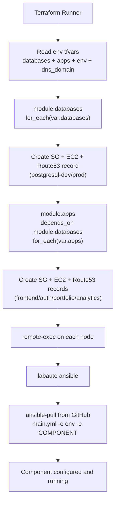

# wmp-terraform-v6

Terraform project to provision the Wealth Management Platform (WMP) infrastructure on AWS, create DNS records in Route53, and bootstrap each server with Ansible.

## What this project creates

For each component in `environments/*/main.tfvars`, Terraform creates:

- An EC2 instance (AMI: `Redhat-9-DevOps-Practice`)
- A dedicated security group with ingress ports from the component definition
- A private Route53 A record: `<component>-<env>.<dns_domain>`
- A remote bootstrap step that runs:
  - `sudo labauto ansible`
  - `ansible-pull ... -e env=<env> -e COMPONENT=<component>`

Current components:

- `postgresql` (DB)
- `frontend`
- `auth-service`
- `portfolio-service`
- `analytics-service`

## Architecture created

This repo uses one reusable module (`modules/component`) and instantiates it twice:

- `module.databases` for `var.databases`
- `module.apps` for `var.apps` (depends on databases)

High-level flow:

1. Read environment variables from `environments/<env>/main.tfvars`
2. Create DB instances first
3. Create app instances next
4. Register private DNS records in Route53
5. Configure each instance using `ansible-pull`




## Project structure

- `provider.tf`: AWS provider (`us-east-1`)
- `state.tf`: S3 backend declaration
- `variables.tf`: top-level inputs (`databases`, `apps`, `dns_domain`, `env`)
- `main.tf`: module orchestration (`databases` then `apps`)
- `modules/component/`:
  - `data.tf`: AMI lookup + Route53 zone lookup
  - `main.tf`: security group, instance, Route53 record, bootstrap
  - `variables.tf`: module inputs
- `environments/dev/`:
  - `main.tfvars`: components/ports/types for dev
  - `state.tfvars`: backend key for dev state
- `environments/prod/`: same pattern for prod
- `Makefile`: one-command apply/destroy for dev/prod
- `configure-prereqs.sh`: install/configure Terraform + AWS CLI + optional AWS profile (see below)
- `check-prereqs.sh`: verify Terraform on `PATH` and AWS credentials (`sts get-caller-identity`)

## Prerequisites

- Terraform installed and available in `PATH`
- AWS credentials configured locally (profile/env vars)
- Access to:
  - S3 bucket `terraform-state-d88`
  - Route53 zone matching `dns_domain`
  - EC2/VPC resources in `ap-south-2`
- SSH connectivity from Terraform runner to created EC2 private IPs (for `remote-exec`)

### Configure prerequisites (automated)

On **Linux** (RHEL/Ubuntu-style control host), you can install and wire basics with:

```bash
cd Terraform/wmp-terraform-v6
chmod +x configure-prereqs.sh check-prereqs.sh
./configure-prereqs.sh
```

What **`configure-prereqs.sh`** does:

- Installs **Terraform** if missing (HashiCorp repo via `dnf` or `apt-get`).
- Installs **AWS CLI v2** if missing (official bundle).
- Optionally writes **`~/.aws/config`** / **`credentials`** for a named profile when you pass keys or set env vars.
- Runs **`aws sts get-caller-identity`** using **`AWS_PROFILE`** (or `default`) when keys were configured.

Examples:

```bash
# Defaults: profile from AWS_PROFILE or "default", region from AWS_REGION (script default if unset)
./configure-prereqs.sh

./configure-prereqs.sh --region ap-south-2

./configure-prereqs.sh --profile devops --region ap-south-2 \
  --aws-access-key-id AKIA... \
  --aws-secret-access-key '...'
```

Same inputs via environment variables:

```bash
export AWS_PROFILE=devops
export AWS_REGION=ap-south-2
export AWS_ACCESS_KEY_ID=...
export AWS_SECRET_ACCESS_KEY=...
./configure-prereqs.sh
```

If you **do not** pass keys, the script skips writing secrets and reminds you to run **`aws configure --profile <name>`** manually.

After configuration (or if everything was already installed), validate without changing the system:

```bash
./check-prereqs.sh
```

**Windows note:** These scripts target a **Linux/macOS-style** shell. On Windows, run them in **WSL**, **Git Bash**, or your Terraform runner EC2 box—not plain `cmd.exe`.

## How to run

From this directory:

```bash
cd Terraform/wmp-terraform-v6
```

### Makefile shortcuts

Dev:

```bash
make dev-apply
make dev-destroy
```

Prod:

```bash
make prod-apply
make prod-destroy
```

### Manual Terraform commands (equivalent)

Dev:

```bash
terraform init -backend-config=environments/dev/state.tfvars
terraform plan -var-file=environments/dev/main.tfvars
terraform apply -var-file=environments/dev/main.tfvars
```

Prod:

```bash
terraform init -backend-config=environments/prod/state.tfvars
terraform plan -var-file=environments/prod/main.tfvars
terraform apply -var-file=environments/prod/main.tfvars
```

Destroy (example dev):

```bash
terraform destroy -var-file=environments/dev/main.tfvars
```

## Flow of learning (recommended)

Use this order if you are learning Terraform + Infra automation:

1. **Understand inputs first**
  - Read `environments/dev/main.tfvars`
  - Identify how `databases` and `apps` maps drive infrastructure
2. **Understand orchestration**
  - Read root `main.tf`
  - See `for_each` over `databases` and `apps`
  - Note `depends_on = [module.databases]` for app sequencing
3. **Understand one component module deeply**
  - Read `modules/component/main.tf`
  - Track resources in order: SG -> EC2 -> DNS -> bootstrap
4. **Understand data sources**
  - Read `modules/component/data.tf`
  - See how AMI and hosted zone are resolved dynamically
5. **Understand state separation**
  - Compare `environments/dev/state.tfvars` and `environments/prod/state.tfvars`
  - Observe separate state keys: `wmp-v6/dev/...` and `wmp-v6/prod/...`
6. **Run a safe lifecycle**
  - Start with `terraform plan` on dev
  - Then `make dev-apply`
  - Validate resources and DNS
  - Finish with `make dev-destroy`
7. **Promote to prod**
  - Re-use same flow with prod tfvars once dev is stable

## Key behavior to remember

- DNS records use private IP: `<component>-<env>.<dns_domain>`
- Apps are created after databases
- Configuration is delegated to Ansible via `ansible-pull` from each node
- Env split is done entirely through tfvars (not separate code)

## Notes and caveats

- Current security groups allow component ports from `0.0.0.0/0`. Tighten CIDRs before production hardening.
- `remote-exec` currently uses SSH password in Terraform code. Prefer key-based auth and secrets handling.
- `ansible-pull` URL points to `wmp-ansible-v4`. Ensure this is intentional and version-aligned with your Ansible repo.

